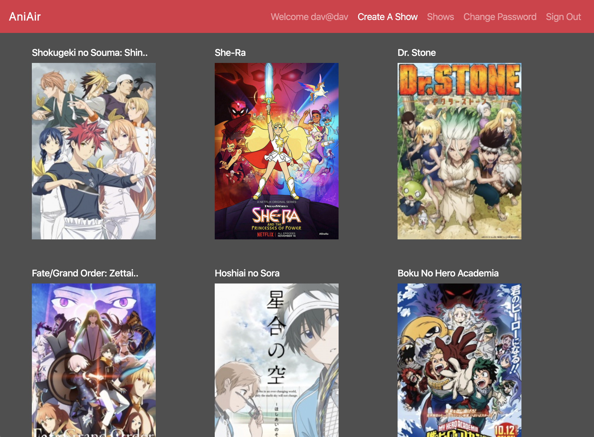

# AniAir Client
### Frontend

AniAir is a show tracking website for currently airing anime. Users can sign up, sign in, change their password, and sign out. On sign in a user can look at all currently airing shows or look at their current watchlist. While browsing the current shows a user can either click on the show thumbnail for more info or add it to their watchlist.

When a user checks their watchlist it displays all shows that they have selected and also the day of the week that the show airs on.

### Setup and local installation
1. Clone repository
2. `npm install` for dependencies
3. Use links below to go to client repository, clone and install that
4. `nodemon serve` to run a localhost

#### Deployed Frontend App:
https://d-raimon.github.io/aniair-client/#/

#### Frontend Repo:
https://github.com/D-Raimon/aniair-client

#### Deployed Backend:
https://thawing-fjord-30518.herokuapp.com/

#### Backend Repo:
https://github.com/D-Raimon/aniair-api

#### Technologies Used:
- React
- Express
- JavaScript
- HTML
- CSS
- Bootstrap
- mongoDB
- Mongoose
- axios

#### Unsolved Problems / Stretch Goals
- Use a third party API to fetch currently airing shows instead of adding manually.
- Automatically split watchlist up by day of week and display the shows in a tabs table.
- Also display the youtube trailer for each show when you click on it for more info.
- Use GraphQL instad of a RESTful API for the backend.
- Style the app better so it is more appealing to the user.

#### Planning & Process

  I started off the project by drafting up some wireframes and user stories to get a better idea of how I wanted my site to look, and also the functionality that I wanted it to have. Once I had a general layout in mind I got to work setting up the backend.
  For the backend I decided to go with Express/mongoDB instead of a Ruby on Rails/SQL due to the flexibility of the prior. This proved to be the right choice as I was creating this app as I had to go back to the schema multiple times to make slight adjustments. Overall building out the backend wasn't to challenging for the shows and watchlist resources as those were completed fairly quickly with minor tweaks along the way to their schemas. However the most challenging and rewarding part of the back end was the admin feature that I added so that only certain users would have the authority to add, modify, and delete the shows resource.
  Once the backend was completed and successfully tested via postman I began work on the frontend. I decided to use React for this part of the app and began by working with the shows resource first. Setting up the routes/components for getting all shows, getting a single show, creating a show, and deleting a show was accomplished fairly quickly. But similar to the backend getting my admin feature to play nice and only display certain actions for admin users proved to be a hurdle that slowed me down, but was eventually overcome. The last piece that I worked on was the watchlist and that was accomplished by simply adding a watchlist component that would get a users show and also allow the user to delete the show from their list. Lastly a button was added to the shows and show components to allow a user to add any particular show to their watchlist.

#### Routes
<table style="display:inline">
<th colspan="2" style="text-align:center">Shows</th>
<th colspan="2" style="text-align:center">User</th>
<tr>
<td>GET</td>
<td>/shows</td>
<td>POST</td>
<td>/sign-up</td>
</tr>
<tr>
<td>GET</td>
<td>/shows/:id</td>
<td>POST</td>
<td>/sign-in</td>
</tr>
<tr>
<td>POST</td>
<td>/shows</td>
<td>PATCH</td>
<td>/change-password</td>
</tr>
<tr>
<td>PATCH</td>
<td>/shows/:id</td>
<td>DELETE</td>
<td>/sign-out</td>
</tr>
<tr>
<td>DELETE</td>
<td>/shows/:id</td>
<td></td>
<td></td>
</tr>

</table>

#### User Stories
V1
- As a user I want to sign-up / sign-in
- As a user I want to change my password
- As a user I want to be able to sign-out
- As a user I want to be able to create a watch list
- As a user I want to be able to search for shows
- As a user I want to be able to get more info for the shows
- As a user I want to add a show to my watch list
- As a user I want to remove a show from my watch list
- As an admin I want to be able to add shows to the currently airing list

V2
- As a user I want to be able to watch a trailer for the show
- As an admin I want to allow users to view current shows via a 3rd-party api

#### Wireframes

#### ERD

